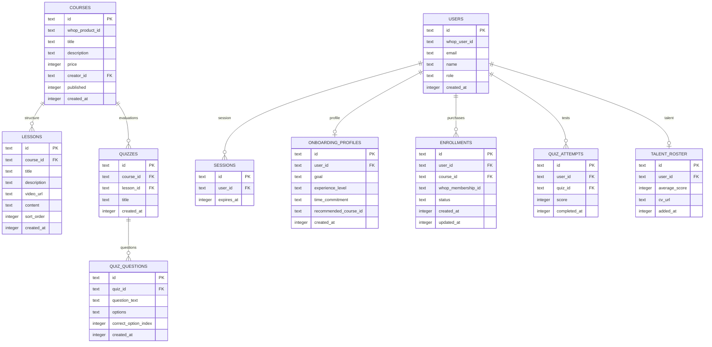

# 🗺️ Roadmappers — Interactive Learning Roadmaps

<p align="center">
  
  
  
  
  
</p>

---

## 🌟 Key Value Proposition

**Roadmappers** is a high-performance educational learning platform designed to bridge the gap between world-class **Mentors** (content creators) and **Students** seeking highly structured, interactive learning roadmaps. 

Powered by **Whop.com** checkouts, the platform automates secure course access licensing, checklist timelines progress tracking, and recruiter-ready talent placements.

---

## 🚀 Interactive User Journeys

### 🎓 For Students
*   **Instant Sign-In**: Authenticate in seconds via **Whop.com OAuth 2.1** Single Sign-On.
*   **Diagnostic Survey**: A 3-step profiling wizard matches and recommends courses matching your experience level and goals on first login.
*   **Timeline Checklists**: Interactive, node-based checklists let you check off completed steps on your learning path.
*   **Media Center**: Aspect-ratio locked, responsive video player supporting HLS adaptive streaming playbacks.
*   **Career Roster**: Score **&gt;= 85%** on course quizzes to get automatically indexed on the platform **Talent Placement Roster** for recruiters.

### 🎙️ For Mentors
*   **Course Builder**: Build and publish course modules containing customizable syllabi, lessons, reading notes, and multi-choice quizzes.
*   **Admin Splits**: Track student enrollments and calculate revenue splits.

### 🛡️ For Admins
*   **Recruitment Portal**: Access a private dashboard to filter, review, and contact top-performing talent (scores &gt;= 85%).
*   **Financial Ledgers**: Track course sales, monitor platform cuts (30%), and calculate mentor splits (70%) for manual month-end transfers.

---

## 🛠️ Technology Stack & Design System

*   **Core**: Next.js App Router (standalone server container ready), React 19, TypeScript.
*   **Database**: **Turso (Serverless SQLite)** for fast edge querying, managed via **Drizzle ORM**.
*   **Styling**: **Tailwind CSS v4** featuring a customized dark-mode aesthetic with glassmorphic cards, glowing borders, and neon cyan (`#06b6d4`) and violet (`#8b5cf6`) accents.

---

## ⚙️ Integrations & Infrastructure

### 💳 Whop.com Payments & Access
Checkout, pricing, and subscription licensing are offloaded to **Whop.com**.
*   **Verified Webhooks**: The route at `/api/webhook/whop` verifies incoming HTTP requests using HMAC-SHA256 signatures with the `WHOP_WEBHOOK_SECRET`.
*   **Fulfillment**: `membership.activated` events automatically create enrollments in the database, while `membership.deactivated` events lock student access.

### 📹 Video Playback
*   Supports **Bunny.net Stream HLS** adaptive player playbacks with domain-locking security.

---

## 🗄️ Database Schema Blueprint



---

## 🚀 Quick Start Guide

### 1. Configure Local Environment
Create an `.env.local` file in the root directory:
```env
DATABASE_URL="libsql://your-database-name.turso.io"
DATABASE_AUTH_TOKEN="your_turso_auth_token"

WHOP_CLIENT_ID="your_whop_client_id"
WHOP_CLIENT_SECRET="your_whop_client_secret"
WHOP_REDIRECT_URI="http://localhost:3000/api/auth/whop/callback"
WHOP_WEBHOOK_SECRET="your_whop_webhook_secret"
```

### 2. Install & Run
```bash
# Install dependencies
npm install

# Push database schema to Turso
npx drizzle-kit push

# Seed sample courses & lessons
npm run db:seed

# Start development server
npm run dev
```
Open [http://localhost:3000](http://localhost:3000) to view the application.
